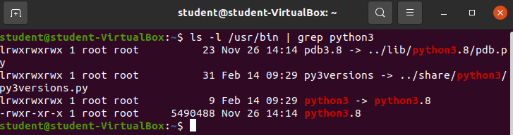

## Demo: Creating & Executing a Bash Script

In this Demo your instructor will show you how to create and execute a bash script, how to add to the `$PATH` Shell Variable, and how to create a `SymLink`. This demo will also give a sneak peek into creating directories and files from the Bash shell.

### Create Directory & File

- `mkdir /home/student/bin`
- `nano /home/student/bin/whattimeisit`

Add the following text into the file.

```bash
#!/bin/bash

echo "Hello Paul..."
echo "It is currently $(date)"
echo "Have a nice day!"
```

### Execute the file using the Bash command

- run the file `bash /home/student/bin/whattimeisit`

### Make the file executable & execute in new ways

- make the file executable `chmod +x /home/student/bin/whattimeisit`
- run the file `/home/student/bin/whattimeisit`
  - or `./bin/whattimeisit`
  - or `bash /home/student/bin/whattimeisit`

### Adding `/home/student/bin` to `$PATH`

- what is my $PATH `echo $PATH`
- I just want to add this new dir to my path `PATH=$PATH:/home/student/bin`

### Execute the program directly from `$PATH`

- now I can just run `whattimeisit`

### Rename file

- what if I want to change the name of my program?
  - `rename whattimeisit when`

### Run same program with new name

- run `when`

### How can the executable file for the `when` program?

- what happens if we `which when`

### Does the `when` program have a man page?

- what happens if we `man when`

### Symlink

#### Where is `python`?

- python comes standard as a part of most Linux distros
- `which python` --> so where is it?
- `which python3` --> here it is (python 2 is dead and has been fully replaced by python3) --> older versions of Ubuntu did have python which defaulted to Python2 & also had a version of Python3 installed.

#### Manually search for python3 in `/usr/bin`

- let's take a look at /usr/bin `ls /usr/bin`
  - python should be here, manually search for it
    - why is it blue?
    - why is there a Python3.8 that is green?

#### Take a deeper look at the file metadata

- could do it manually with `ls -l /usr/bin`, but that would take a while

- let's use grep to search for the output we want instead: `ls -l /usr/bin | grep python3`



What is `python3 -> python3.8` representing? It looks like `python3` is a shortcut to `python3.8`!

- what is a Symlink?
  - it really is just a shortcut
  - soft link
  - both `python3` and `python3.8` should execute the same program

### Edit our program to be callable with a SymLink

#### Change name back to whattimeisit

- `rename when whattimeisit`

#### Create a SymLink pointing to whattimeisit named when

- `ln -s whattimeisit when`

#### How can we run the program?

- `whattimeisit`
- `when`

This explains what Python3 is in /usr/bin -- just a symlink pointing at the actual python3.8 interpreter!


{}
In Ubuntu the color scheme of STDOUT is helpful. Green files are executable, light blue files are SymLinks, dark blue files are directories, white files are just standard files. Not all terminal emulators support color, but it is quite useful when it is around.
{}