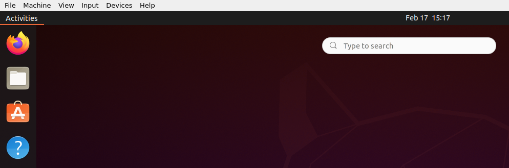
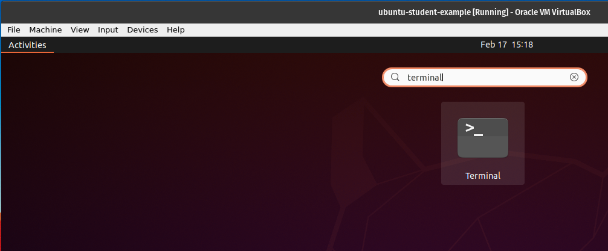
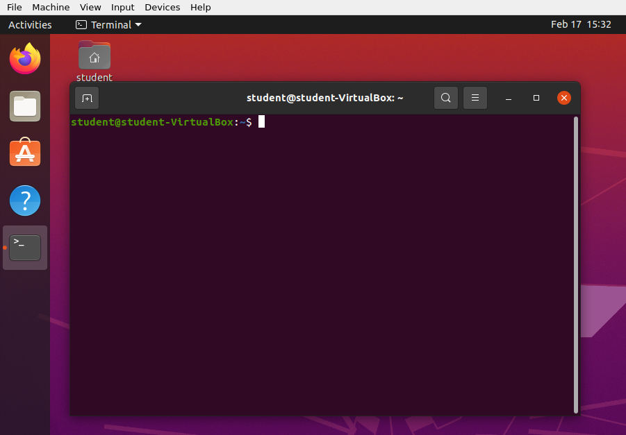
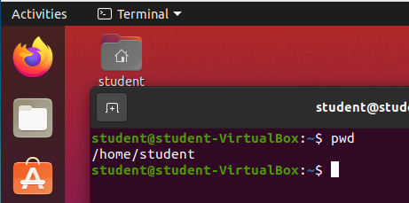
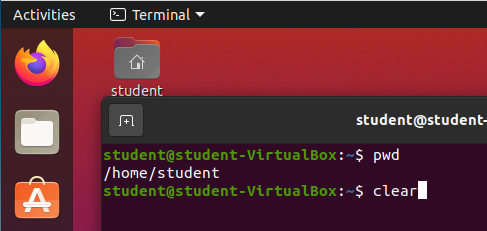
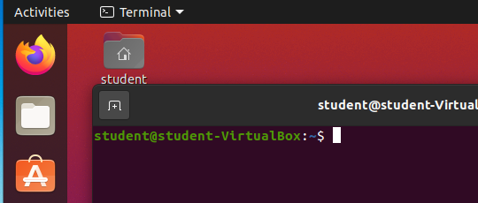
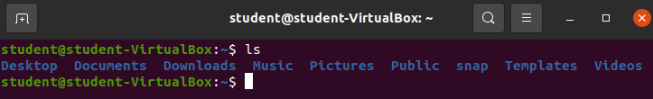
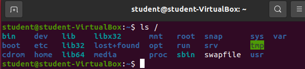
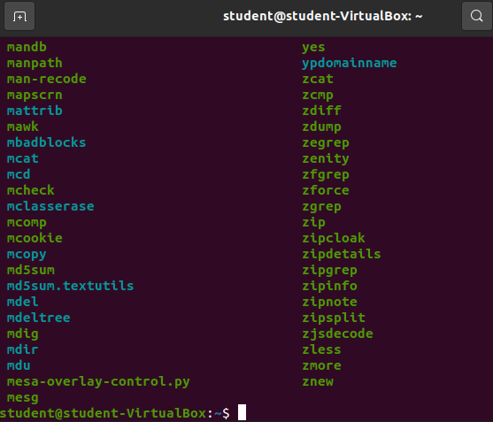
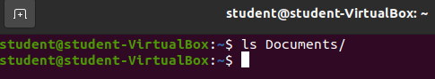

## Walkthrough

**Bash** is *the* GNU Project's shell. A **shell** is an interface between a user and the kernel. Bash is a **text-based** shell. By learning aspects of the Bash shell you are learning a *powerful mechanism* for interfacing with a computer.

### Terminal Emulator

To use this text-based Bash shell on our Ubuntu machines we will need to open a **terminal emulator** application. The terminal emulator is the graphical software that provides many features including: 
- a window
- a window exit button
- minimize and maximize window buttons

The terminal emulator is also configured to:
- handle key-press events
- handle click events
- receive Bash commands 
- display Bash Standard Output (STDOUT)

The **terminal emulator** we will be using in this class is simply called **terminal**. You can find it by clicking the *Activities* button in the top left corner of your Ubuntu screen.

Then search for the program `terminal`.

Either hit enter, or click the `terminal` application and a new `terminal emulator` will be launched!

### Bash Command Basics

This Bash shell is expecting text based commands. However, we must follow the rules for inputting the commands.

All Bash commands follow this basic pattern: `command-name --option(s) argument(s)`.

Most commands have at least one argument, however they can have no arguments, provide default arguments, or sometimes allow for multiple arguments.

Bash command options are similar with regards to Bash command arguments. You won't always need an option, however they provide you with options for changing how the command will be executed, or how the output will be displayed. You may use no options, one options, or many options.

### `pwd` command

Let's try out our first command: `pwd`. `pwd` is one of the Bash commands that takes **no arguments**. 

Simply type `pwd` into your terminal and hit enter.

{}
Make sure you only type `pwd` into your terminal before hitting enter. Since the Bash shell is expecting text it requires the text you enter to exactly match it's expectations.
{}

`pwd` stands for print working directory. You will notice the output of the command is simply the text `/home/student`. Which is the current working directory of our Bash shell session.

While in a Bash shell session you will be regularly changing directories. Being able to quickly determine your current working directory is *highly* beneficial.

### `clear` command

Our next command also takes no arguments. `clear` will clear the terminal emulator of all text.

Enter `clear` into your terminal.

Then submit the command with enter.

All that text is gone! We now have a clean slate to continue working.

{}
Most future images will `clear` the screen before running new commands.
{}

### `ls` command

Our next command will list out the contents of either our current working directory or a specific directory: `ls`.

`ls` will use your current working directory as a default argument if you do not provide an argument. So to list out the contents of your current working directory you simply need to enter `ls` and nothing else before submitting the command. Give it a try!

Our home directory `/home/student` has quite a few things in it. All of the entires just happen to be directories:
- Desktop
- Documents
- Downloads
- Music
- Pictures
- Public
- snap
- Templates
- Videos

That's a pretty standard collection of user folders. These happen to be the default folders created when a new user is created in Ubuntu.

#### `ls` with argument

We can provide an argument to the `ls` command, which must be a valid directory, and our Bash shell will list all the contents in that argument!

Let's try looking at all the contents inside of the root directory `/`.

Enter `ls /`.

The **root** directory is the container for all files/directories on this computer! It is the root of our Ubuntu distribution. The root directory contains the `/home` directories of all users, all the tools shared across the machine, and all of the files/directories necessary for the operating system to function.

Let's take a look in the `bin` directory inside of the root directory.

Enter `ls /bin`.

Woah. That's a lot of files! The `/bin` directory is a location of many of the **binaries** used on this operating system. If you scroll through the list you may see some familiar names like `zip` or `python3`. `zip` is used to create and open zipped folders. `python3` is the Python3 interpreter that can run python files.

If you continued to search through this list you will also find the three commands we have already learned (`pwd`, `clear`, `ls`). All three of these programs are simply binaries that the Bash shell is executing for us. Many of the programs we will use in this class are located in this directory!

{}
**Do not create, change or delete any files above your home directory** `/home/student/`, unless this book instructs you to. The files found directly above the user home directories are necessary for the operating system to work properly. Most Linux distributions will allow you direct access to these files.
{}

### `ls` Empty Directory

Let's take a look at the contents inside our current user's `Documents` directory.

Enter `ls Documents`.

Nothing came up. This isn't a bug, this is the output we would expect if there are no contents to be listed.

{}
Try listing the contents of the remaining directories inside of `/home/student/`. Do any of them have contents?
{}

### `ls` Options

#### `-l`

#### `-a`

### `echo`

### Bash Shell Variables

#### `echo $BASH`

#### `echo $HOME`

#### `echo $PATH`

#### `echo $BASHPID`

### `which` command

### Getting Help

#### `man` command

#### `--help` option
