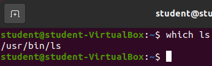
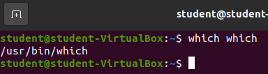
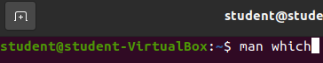
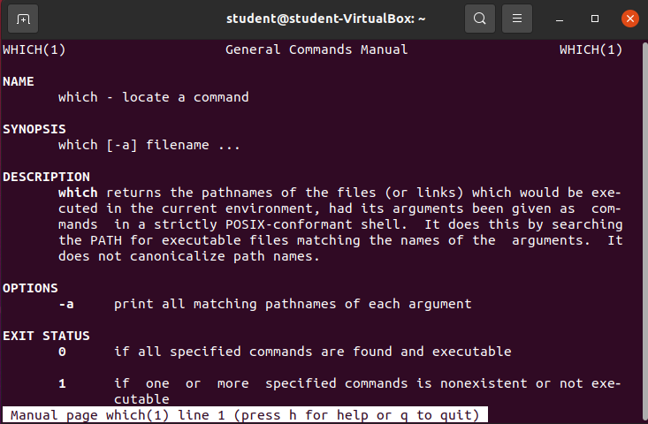
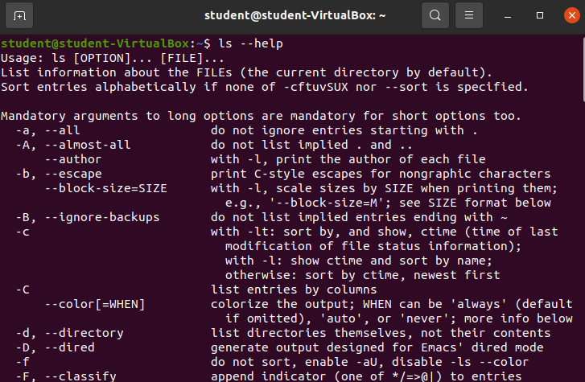

## Walkthrough

**Bash** is *the* GNU Project's shell. A **shell** is an interface between a user and the kernel. Bash is a **text-based** shell. By learning aspects of the Bash shell you are learning a *powerful mechanism* for interfacing with a computer.

### Terminal Emulator

To use this text-based Bash shell on our Ubuntu machines we will need to open a **terminal emulator** application. The terminal emulator is the graphical software that provides many features including: 
- a window
- a window exit button
- minimize and maximize window buttons

The terminal emulator is also configured to:
- handle key-press events
- handle click events
- receive Bash commands 
- display Bash Standard Output (STDOUT)

The **terminal emulator** we will be using in this class is simply called **terminal**. You can find it by clicking the *Activities* button in the top left corner of your Ubuntu screen.

Then search for the program `terminal`.

Either hit enter, or click the `terminal` application and a new `terminal emulator` will be launched!

### Bash Command Basics

This Bash shell is expecting text based commands. However, we must follow the rules for inputting the commands.

All Bash commands follow this basic pattern: `command-name --option(s) argument(s)`.

Most commands have at least one argument, however they can have no arguments, provide default arguments, or sometimes allow for multiple arguments.

Bash command options are similar with regards to Bash command arguments. You won't always need an option, however they provide you with options for changing how the command will be executed, or how the output will be displayed. You may use no options, one options, or many options.

### `pwd` command

Let's try out our first command: `pwd`. `pwd` is one of the Bash commands that takes **no arguments**. 

Simply type `pwd` into your terminal and hit enter.

{}
Make sure you only type `pwd` into your terminal before hitting enter. Since the Bash shell is expecting text it requires the text you enter to exactly match it's expectations.
{}

`pwd` stands for print working directory. You will notice the output of the command is simply the text `/home/student`. Which is the current working directory of our Bash shell session.

While in a Bash shell session you will be regularly changing directories. Being able to quickly determine your current working directory is *highly* beneficial.

### `clear` command

Our next command also takes no arguments. `clear` will clear the terminal emulator of all text.

Enter `clear` into your terminal.

Then submit the command with enter.

All that text is gone! We now have a clean slate to continue working.

{}
Most future images will `clear` the screen before running new commands.
{}

### `ls` command

Our next command will list out the contents of either our current working directory or a specific directory: `ls`.

`ls` will use your current working directory as a default argument if you do not provide an argument. So to list out the contents of your current working directory you simply need to enter `ls` and nothing else before submitting the command. Give it a try!

Our home directory `/home/student` has quite a few things in it. All of the entires just happen to be directories:
- Desktop
- Documents
- Downloads
- Music
- Pictures
- Public
- snap
- Templates
- Videos

That's a pretty standard collection of user folders. These happen to be the default folders created when a new user is created in Ubuntu.

#### `ls` with argument

We can provide an argument to the `ls` command, which must be a valid directory, and our Bash shell will list all the contents in that argument!

Let's try looking at all the contents inside of the root directory `/`.

Enter `ls /`.

The **root** directory is the container for all files/directories on this computer! It is the root of our Ubuntu distribution. The root directory contains the `/home` directories of all users, all the tools shared across the machine, and all of the files/directories necessary for the operating system to function.

Let's take a look in the `bin` directory inside of the root directory.

Enter `ls /bin`.

Woah. That's a lot of files! The `/bin` directory is a location of many of the **binaries** used on this operating system. If you scroll through the list you may see some familiar names like `zip` or `python3`. `zip` is used to create and open zipped folders. `python3` is the Python3 interpreter that can run python files.

If you continued to search through this list you will also find the three commands we have already learned (`pwd`, `clear`, `ls`). All three of these programs are simply binaries that the Bash shell is executing for us. Many of the programs we will use in this class are located in this directory!

{}
**Do not create, change or delete any files above your home directory** `/home/student/`, unless this book instructs you to. The files found directly above the user home directories are necessary for the operating system to work properly. Most Linux distributions will allow you direct access to these files.
{}

### `ls` Empty Directory

Let's take a look at the contents inside our current user's `Documents` directory.

Enter `ls Documents`.

Nothing came up. This isn't a bug, this is the output we would expect if there are no contents to be listed.

{}
Try listing the contents of the remaining directories inside of `/home/student/`. Do any of them have contents?
{}

### `ls` Options

`ls` has many options for you to choose from, however the two most common options are:
- `--long`: show the permissions, size and date last modified among other meta-data
- `--all`: show all files and directories including hidden

#### `-l`

Enter `ls -l` to see the long form output for the current directory.

Most of the information isn't relevant to us yet, but it's still important to know how to access it.

#### `-a`

Enter `ls -a` to see all the files and folders including any that may be hidden for the current directory.

Here we can see a few hidden files, and directories. All of the hidden files and folders start with a period `.`. 

{}
Your `ls -a` output may look slightly different from the provided image. Many hidden files and folders are created in the home directory to keep track of shell histories, shell profiles, and various configurations. As you continue to use this operating system your home directory will fill up with some of these files and directories. 
{}

### `echo`

The next command `echo` simply prints out a message to the Bash shell's Standard Output (STDOUT). An echo statement is very similar to the `print()` method in Python3, or the `console.log()` method in JavaScript, or the `System.out.println()` method in Java.

To use the `echo command` we simply need to invoke the command with one argument that results in a string.

Enter `echo "Hello world"`.

{}
`echo` commands are especially useful inside of Bash scripts. In any given Bash script many things be happening and outputting some message to the individual that invokes the script is a very useful feature.
{}

The `echo` command can be used to easily view the contents of a Shell Variable. Your home directory, path, and many other variables are attached directly to your Bash Shell in the form of variables. You can use `echo $VARIABLE` to easily view the contents of the variable.

### Bash Shell Variables

#### `echo $BASH`

The `$BASH` shell variable contains the absolute path to the shell this session is using. 

#### `echo $HOME`

The `$HOME` shell variable contains the absolute path to the home directory of the user that initiated the Bash shell.

#### `echo $PATH`

The `$PATH` shell variable contains a collection of all of the tools currently accessible to this current Bash Shell session.

Any files and subdirectories found within the listed directories are available to be invoked by name.

{}
If you have ever tried to run a program before and received a message about the command not being found in the path, this is what it was referring to. When installing new programming languages, build tools, or really any software that needs to be used from a shell the location of the tool *must* be added to the path variable. Lots of software installations take care of adding the tool to your path by either editing the PATH variable or by simply adding the binary of the software directly to one of the directories listed in your path.
{}
#### `echo $BASHPID`

The `$BASHPID` shell variable contains the process ID of the current Bash Shell. This number will likely be different for everyone. In fact if you open your current terminal and open a new one and then check the `$BASHPID` shell variable you should notice that it is different.

Every running program has at least one process running and therefore a process ID. Many programs will create multiple processes and each of their children processes will have unique IDs, however the program's initial main process is the parent of all other associated process IDs.

{}
We will not be learning about processes in this class. Taking the time to learn about processes will make you a better Linux user, but goes deeper than we need to know in this class.
{}

#### `kill` command

The `kill` command sends signals to a specific process. These signals give you a way to affect the process. 

One of the most common signals we may want to send to a running process is to end the process. This would immediately stop the process and free up any CPU, RAM, or hard disk operations the process is currently utilizing.

Sending signals to a process is a powerful tool for using Linux. You will not be expected to know the `kill` command in this class.

However, if you want to try the command out, you can send a signal to your `$BASHPID` to kill the process.

Take note of your `$BASHPID`.

Then enter `kill -9 your-bash-pid`, but enter the number of your `$BASHPID`.

Upon entering this command you should see your terminal close immediately!

Once you entered the command the Bash Shell sent a `SIGKILL` (`-9`) signal to the process associated with your `$BASHPID`. The `SIGKILL` signal notifies the operating system the process, and any child processes, needs to be terminated immediately and must be completed. Your operating system acts on the command and the Bash Shell associated with your `$BASHPID` is closed.

There are various other signals that can be sent to processes, but they go beyond the scope of this class.

{}
Linux will perform whatever commands you instruct it to. You could conceivably start sending `SIGKILL` signals to random process IDs and Linux will terminate them. Everything running on your operating system has a process ID and you could terminate a process responsible for the Graphical User Interface of your operating system, or some software managing your hardware, which would require you to restart your machine to fix the issue.
{}

{}
If you want to send a `SIGKILL` signal to your `$BASHPID` without first looking up the value of the Shell Variable you can do that with a Bash Variable Substitution. You can simply reference the variable directly in a Bash Command!

{}

### `which` command

Most of the commands we have learned about in this class come standard as a part of the Ubuntu distribution we have been using. We will eventually learn about adding new commands and tools to our existing distribution. It is important to know the specific location of a command on your computer, something we can locate easily by using the `which` command.

The `which` command will give you the absolute path of the file that is being used to execute the instructions.

Let's find out where the `ls` command's binary lives.

Enter `which ls`.

According to the `which` command `ls` resides in `/usr/bin/ls`.

{}
In Linux when you see something named `bin` it is almost always short for the word `binary`. A `binary` file is a file that **is not readable** to humans. Many `binary` files are executable programs. In fact, looking into the `/usr/bin` and `/bin` directories you may see the names of many executable programs that we have already used in this class!
{}

#### `which which`?

What about the `which` command? It is also an executable command so it should also have a location on our machine. How can we figure out where the `which` command resides?

It looks like the which command is also an executable binary located in `/usr/bin`.

### Getting Help

There are tons of commands you can use in Linux. It would take an enormous amount of time for any person to learn all of them.

Luckily, Linux and GNU have provided multiple ways for us to learn about the various commands we may want to use.

#### `man` command

The `man` command is used to bring up the reference manual for any given command. These reference manuals are often called **man pages**

Let's take a look at the man page for the `which` command.

Enter `man which`.

The output of our screen changed considerably. We no longer have a means for entering commands. We are looking at a `less` display screen. We will learn about `less` in a future lesson. You can move up and down on this page with the directional keys. Alternatively you can use the `j` key to move down, and the `k` to move up.

The second thing to notice is how much useful information is being provided about the `which` command. This man page contains a Synopsis giving a brief example of how you can use the command. It also contains a highly beneficial description that goes far beyond what we learned just a moment ago. All of the possible options are listed and message about what that option is.

The **man pages** are one of the most powerful tools for learning, or remembering, how to use a command effectively.

To **exit the man pages** you simply need to press the `q` key on your keyboard.

{}
Checkout the **man pages** of the additional commands you have learned about in this class.
{}

#### `--help` option

The man pages are exhaustive and provide additional context, that can sometimes be distracting when you are solving a problem in the moment.

Many commands contain a `--help` or `-h` option that will give you an abbreviated list of the most common options or arguments you may want to use.

Enter `ls --help`.

After scrolling to the top of the STDOUT we can see a shortened version of the man page. A brief description, and a list of options. All of this without leaving our terminal!

The `--help` flag isn't enabled for all commands, but can provide assistance in a pinch.

### Review

We covered a lot of ground in this walkthrough. Look over the following list of terms used throughout this article:
- Shell
- Terminal Emulator
- Bash Shell
- Bash Commands
  - argument(s)
  - option(s)
  - `pwd`
  - `clear`
  - `ls`
  - `echo`
  - `which`
- Shell Variables
  - `$BASH`
  - `$HOME`
  - `$PATH`
  - `$BASHPID`
- Manual Pages
  - `man filename`
- `--help`
  - `command --help`

In a future lesson we will learn even more about the Bash Shell in the form of file-system navigation, and file/directory creation, editing, and deleting.