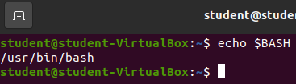
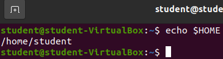
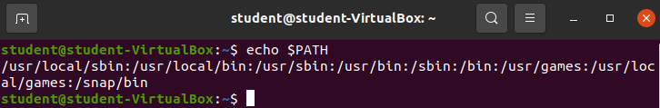
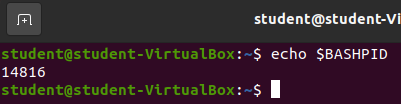

## Bash Shell Variables

The Bash shell has numerous variables that contain useful information. They are indicated by the following pattern: `$VARIABLE_NAME`.

We won't look at all of the Bash Shell Variables, but we would like you to know about four of them:

- `$BASH`
- `$HOME`
- `$PATH`
- `$BASHPID`

To view the contents of any Bash Shell variable you can simply use the variable as the argument with the `echo` command.

### `echo $BASH`

The `$BASH` shell variable contains the absolute path to the shell this session is using. 

### `echo $HOME`

The `$HOME` shell variable contains the absolute path to the home directory of the user that initiated the Bash shell.

### `echo $PATH`

The `$PATH` shell variable contains a collection of all of the tools currently accessible to this current Bash Shell session.

Any files and subdirectories found within the listed directories are available to be invoked by name.

{}
If you have ever tried to run a program before and received a message about the command not being found in the path, this is what it was referring to. When installing new programming languages, build tools, or really any software that needs to be used from a shell the location of the tool *must* be added to the path variable. Lots of software installations take care of adding the tool to your path by either editing the PATH variable or by simply adding the binary of the software directly to one of the directories listed in your path.
{}

### `echo $BASHPID`

The `$BASHPID` shell variable contains the process ID of the current Bash Shell. This number will likely be different for everyone. In fact if you open your current terminal and open a new one and then check the `$BASHPID` shell variable you should notice that it is different.

Every running program has at least one process running and therefore a process ID. Many programs will create multiple processes and each of their children processes will have unique IDs, however the program's initial main process is the parent of all other associated process IDs.

{}
We will not be learning about processes in this class. Taking the time to learn about processes will make you a better Linux user, but goes deeper than we need to know in this class.
{}