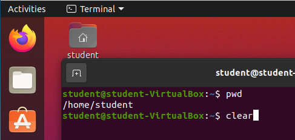
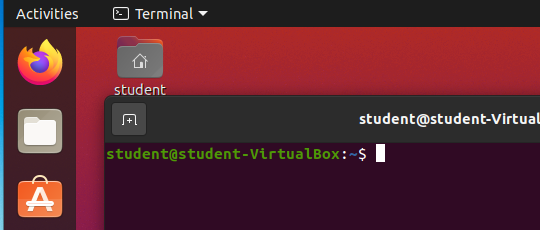

## `clear` command

Our next command also takes no arguments. `clear` will clear the terminal emulator of all text.

Enter `clear` into your terminal.

Then submit the command with enter.

All that text is gone! We now have a clean slate to continue working.

{}
Most future images will `clear` the screen before running new commands.
{}