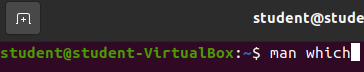
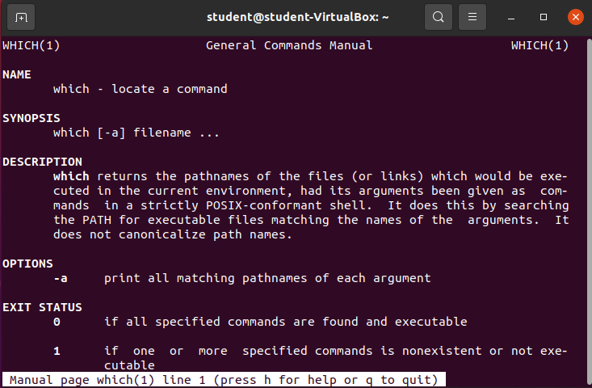
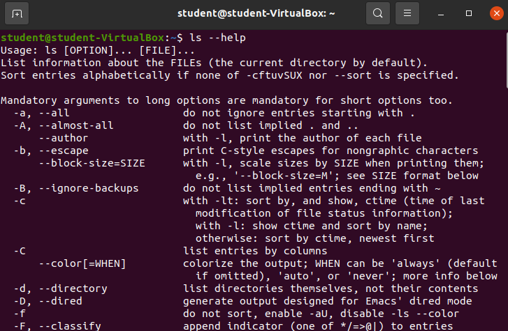

## Getting Help

There are tons of commands you can use in Linux. It would take an enormous amount of time for any person to learn all of them.

Luckily, Linux and GNU have provided multiple ways for us to learn about the various commands we may want to use.

### `man` command

The `man` command is used to bring up the reference manual for any given command. These reference manuals are often called **man pages**

Let's take a look at the man page for the `which` command.

Enter `man which`.

The output of our screen changed considerably. We no longer have a means for entering commands. We are looking at a `less` display screen. We will learn about `less` in a future lesson. You can move up and down on this page with the directional keys. Alternatively you can use the `j` key to move down, and the `k` to move up.

The second thing to notice is how much useful information is being provided about the `which` command. This man page contains a Synopsis giving a brief example of how you can use the command. It also contains a highly beneficial description that goes far beyond what we learned just a moment ago. All of the explanations are listed for each option.

The **man pages** are one of the most powerful tools for learning, or remembering, how to use a command effectively.

To **exit the man pages** you simply need to press the `q` key on your keyboard.

{}
Checkout the **man pages** of the additional commands you have learned about in this class.
{}

### `--help` option

The man pages are exhaustive and provide additional context, that can sometimes be distracting when you are solving a problem in the moment.

Many commands contain a `--help` or `-h` option that will give you an abbreviated list of the most common options or arguments you may want to use.

Enter `ls --help`.

After scrolling to the top of the STDOUT we can see a shortened version of the man page. A brief description, and a list of options. All of this without leaving our terminal!

The `--help` flag isn't enabled for all commands, but can provide assistance in a pinch.