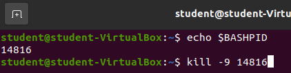
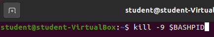

## `kill` command

The `kill` command sends signals to a specific process. These signals give you a way to affect the process. 

One of the most common signals we may want to send to a running process is to end the process. This would immediately stop the process and free up any CPU, RAM, or hard disk operations the process is currently utilizing.

Sending signals to a process is a powerful tool for using Linux. You will not be expected to know the `kill` command in this class.

However, if you want to try the command out, you can send a signal to your `$BASHPID` to kill the process.

Take note of your `$BASHPID`.

Then enter `kill -9 [your-bash-pid]`, but enter the number of your `$BASHPID`.

Upon entering this command you should see your terminal close immediately!

Once you entered the command the Bash Shell sent a `SIGKILL` (`-9`) signal to the process associated with your `$BASHPID`. The `SIGKILL` signal notifies the operating system the process, and any child processes, needs to be terminated immediately and must be completed. Your operating system acts on the command and the Bash Shell associated with your `$BASHPID` is closed.

There are various other signals that can be sent to processes, but they go beyond the scope of this class.

{}
Linux will perform whatever commands you instruct it to. You could conceivably start sending `SIGKILL` signals to random process IDs and Linux will terminate them. Everything running on your operating system has a process ID and you could terminate a process responsible for the Graphical User Interface of your operating system, or some software managing your hardware, which would require you to restart your machine to fix the issue.
{}

{}
If you want to send a `SIGKILL` signal to your `$BASHPID` without first looking up the value of the Shell Variable you can do that with a Bash Variable Substitution. You can simply reference the variable directly in a Bash Command!

{}