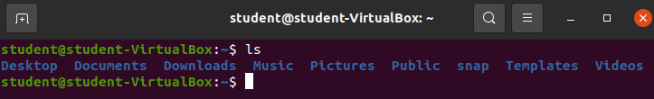
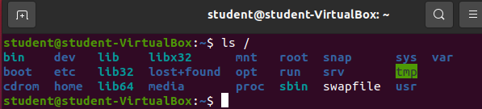
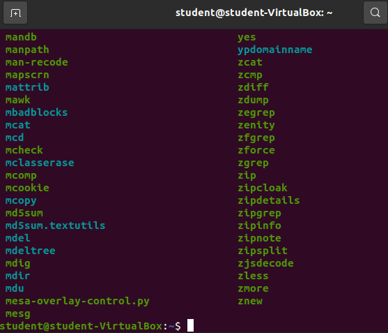
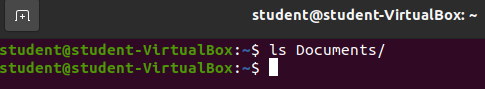
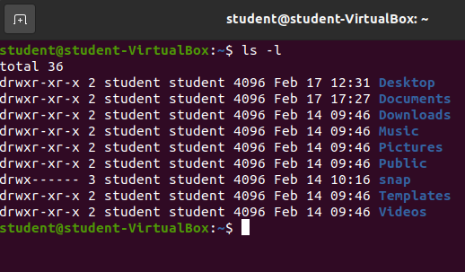
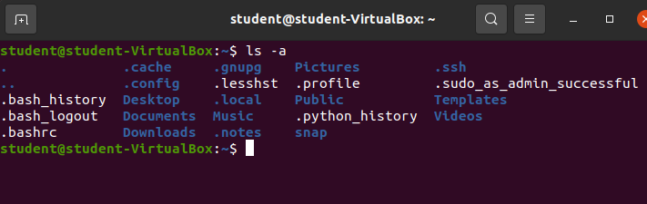

## `ls` command

Our next command will list out the contents of either our current working directory or a specific directory: `ls`.

`ls` will use your current working directory as a default argument if you do not provide an argument. So to list out the contents of your current working directory you simply need to enter `ls` and nothing else before submitting the command. Give it a try!

Our home directory `/home/student` has quite a few things in it. All of the entries just happen to be directories:
- Desktop
- Documents
- Downloads
- Music
- Pictures
- Public
- snap
- Templates
- Videos

That's a pretty standard collection of user folders. These happen to be the default folders created when a new user is created in Ubuntu.

### `ls` with argument

We can provide an argument to the `ls` command, which must be a valid directory, and our Bash shell will list all the contents in that argument!

Let's try looking at all the contents inside of the root directory `/`.

Enter `ls /`.

The **root** directory is the container for all files/directories on this computer! It is the root of our Ubuntu distribution. The root directory contains the `/home` directories of all users, all the tools shared across the machine, and all of the files/directories necessary for the operating system to function.

Let's take a look in the `bin` directory inside of the root directory.

Enter `ls /bin`.

Woah. That's a lot of files! The `/bin` directory is a location of many of the **binaries** used on this operating system. If you scroll through the list you may see some familiar names like `zip` or `python3`. `zip` is used to create and open zipped folders. `python3` is the Python3 interpreter that can run python files.

If you continued to search through this list you will also find the three commands we have already learned (`pwd`, `clear`, `ls`). All three of these programs are simply binaries that the Bash shell is executing for us. Many of the programs we will use in this class are located in this directory!

{}
**Do not create, change or delete any files above your home directory** `/home/student/`, unless this book instructs you to. The files found directly above the user home directories are necessary for the operating system to work properly. Most Linux distributions will allow you direct access to these files.
{}

## `ls` Empty Directory

Let's take a look at the contents inside our current user's `Documents` directory.

Enter `ls Documents`.

Nothing came up. This isn't a bug, this is the output we would expect if there are no contents to be listed.

{}
Try listing the contents of the remaining directories inside of `/home/student/`. Do any of them have contents?
{}

## `ls` Options

`ls` has many options for you to choose from, however the two most common options are:
- `-l`: show the permissions, size, and date last modified among other meta-data (this is often referred to as long listing format)
- `--all`: show all files and directories including hidden

### `-l`

Enter `ls -l` to see the long form output for the current directory.

Most of the information isn't relevant to us yet, but it's still important to know how to access it.

### `-a`

Enter `ls -a` to see all the files and folders including any that may be hidden for the current directory.

Here we can see a few hidden files, and directories. All of the hidden files and folders start with a period `.`. 

{}
Your `ls -a` output may look slightly different from the provided image. Many hidden files and folders are created in the home directory to keep track of shell histories, shell profiles, and various configurations. As you continue to use this operating system your home directory will fill up with some of these files and directories. 
{}