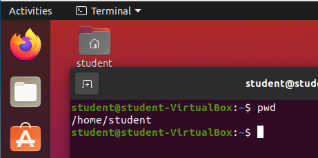

## `pwd` command

Let's try out our first command: `pwd`. `pwd` is one of the Bash commands that takes **no arguments**. 

Simply type `pwd` into your terminal and hit enter.

{}
Make sure you only type `pwd` into your terminal before hitting enter. Since the Bash shell is expecting text it requires the text you enter to exactly match it's expectations.
{}

`pwd` stands for print working directory. You will notice the output of the command is simply the text `/home/student`. Which is the current working directory of our Bash shell session.

While in a Bash shell session you will be regularly changing directories. Being able to quickly determine your current working directory is *highly* beneficial.