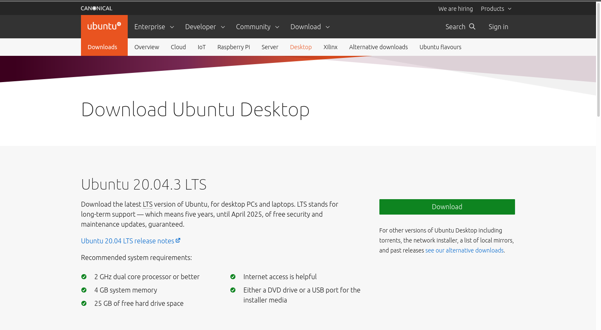

<!-- TODO: add note about having 15 GB free on their computer before performing the steps in this section -->

## Ubuntu

In this class we will be using Ubuntu Desktop 20.04.3 LTS, you can find it's download [on their website](https://ubuntu.com/download/desktop).

### Download Image

Click the green `Download` button to start the download. It is a large file and will take some time.

You will likely have to confirm the download, in the picture below the user will need to click `Save File` for the file to be downloaded onto the host computer.

Regardless of your host OS we will all be using a similar file `ubuntu-20.04.3-desktop-*.iso`. An `.iso` file is a Disk Image which is the instruction for installing an Operating System. We will be using this file inside of Virtualbox to create an isolated Ubuntu 20.04.3 virtual operating system inside of our host computer.
<<<<<<< HEAD
=======

### VirtualBox Ubuntu Image Creation Instructions

- Open VirtualBox

- Within VirtualBox click the new  button

{}
If you have never used VirtualBox before, which is likely, you will be prompted by your host OS to give VirtualBox access to your files including your Downloads, and Documents directories.

Make sure to grant VirtualBox permission to these locations!
{}
<!-- TODO: get the file-access-button.png photo -->
- give it a name (student-VirtualBox) (it should automatically change type to linux)

- machine folder leave as default (`/Users/username/VirtualBox` Vms
{}
Your default location is dependent on your host operating system. If it is Mac it will be /Users/your-name, if you are on Windows it will be `C:\Users\username>`
{}
- click next
- allocating the memory size
  - minimum: 2048
  - ideal: 3072 or greater

- click next
- hard disk
  - create a virtual disc (click the blue create button)

  - leave it on the default VDI

  - storage on physical hard disk: select Fixed size

  - file location and size
    - location: default
    - size: at least 12GB
    - click create

After completing the follow setup you will see the VirtualBox homepage that looks similar to:

Using the picture above as a reference take note of the configurations for this specific image:

##### General

- Name: `student-VirtualBox`
- Operatating System: `Ubuntu (64 bit)`

##### System

- Base Memory: `2048 MB`

##### Storage

- Controller :IDE:
  - IDE Secondary Device 0: `[Optical Drive] Empty`
- Controller :Sata: 
  - SATA Port 0: `student-VirtualBox.vdi (Normal 12.00 GB)`

Take note of the IDE Secondary Device 0, this is referencing the CD drive of this specific image. It is currently empty, which makes sense, as we don't have a CD in our computer! In order to load Ubuntu we are going take the Ubuntu.iso image we downloaded earlier and virtually insert it into this optical drive. This will allow us to boot into Ubuntu and load it into this virtual image.

{}
In this course will not be discussing the audio, network, usb, shared folders, or description.
{}

#### setting up this machine to use our ISO image

- settings wheel (while the name is selected)

  - click the storage option

  - under controller:IDE it says Empty (that's because we haven't told the machine which ISO to use for this machine)

    - on the right side under attributes you should see optional drive drop down box, to the right of that is a disk icon button
    - click that button

    - choose a disk file ...
      - file explorer (ISO)
      - most likely inside downloads (ubuntu-20.04.3-desktop-amd64.iso)
    - after you select the ISO file click the ok button

Upon clicking `Choose a disk file` your host OS will open the default file manager. Using that file manager you need to select the `ubuntu-20.04.3-desktop-amd64.iso` file you downloaded earlier. 

{}
The location of the `ubuntu-20.04.3-desktop-amd64.iso` will likely be in a different location than the example image posted below. 

This image is an example of the default file manager on a Pop!_OS which is an Ubuntu derived distribution.
{}

#### starting the machine

- click start button
{}
You may notice the options within the dropdown next to the start arrow, the options are normal start, headless, detachable start. **During this course we will always be using the normal start. Without doing so you will not have access to the GUI.** To learn more about headless starts which are common, refer to the [Headless Software Wikipedia Article](https://en.wikipedia.org/wiki/Headless_software).
{}

The first time you start your machine it will load the `.iso` file in the virtual optical drive, which will trigger a new installation of Ubuntu. As it is setting up this installation you will see quite a few different screens one of which will look similar to the following image:

Once the installation wizard has finished setting up, you will see the following screen:

{}
If the image is not set properly you will see the following errors (kernel drive not installed) and Failed to open a session for the virtual machine for ubuntu-launchcode

If you see this error you misconfigured your ISO image. Please repeat the steps from the above section.
{}

### Granting priveleges

{}

#### granting your Macbook access to Oracle

- open settings
- click security & privacy
- unlock by clicking padlock and providing your password
- click allow for (System software from developer "Oracle America, Inc." was blocked from loading
- then restart your machine

- keystroke permission on Mac
- open system preferences
- unlock if necessary

- select the checkbox for virtualbox

- exit system preferences
- quit and reopen virtualbox

{}

{}
<!-- TODO: Double check security permissions for windows OS -->
Content coming soon!
{}

#### Installing Ubuntu (First Time Setup)

{}
For Macbook users, if you haven't granted oracle permissions in your security and privacy your machine will not start with a kernel error. If you see this error checkout the section on Granting your Macbook access to Oracle above.
{}

- select your language (default is english)

- click `Install Ubuntu` underneath the laptop icon
{}
Do not click "try ubuntu"
{}

- keyboard layout (keep default, unless you use a non english keyboard)

- click continue
- select minimal installation
- select download updates while installing (accept all the defaults)

- erase disk and install ubuntu (if it detected an OS that means they didn't select a VDI)

- click install now
- click continue
- select your TZ (should default accurately)

click `Install Now`

click `Continue`

- who are you?

  - your name: `student`
  - your computer's name: `student-VirtualBox`
  - username: `student`
  - password: `admin`
  - confirm: `admin`
  - select: `require my password to log in (default)`
  - click: `Continue`

>>>>>>> fixed spacing around photos
