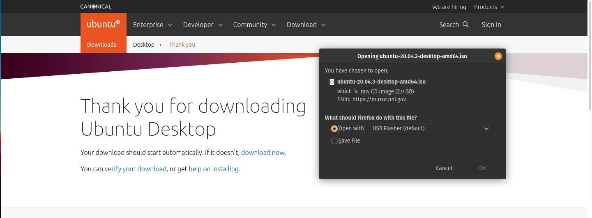

---
<<<<<<< HEAD
title: "Ubuntu"
=======
title: "Walkthrough"
date: 2021-11-09T15:13:39-06:00
>>>>>>> restructured configus for pics starting filling in content
draft: false
weight: 2
original_author: "Paul Matthews" 
reviewer: "" # to be set by the approving reviewer
last_editor: "" # update each time the file is edited
last_edit_date: # just the date is enough (don't worry about the time portion)
---

<<<<<<< HEAD
<!-- TODO: add note about having 15 GB free on their computer before performing the steps in this section -->

## Ubuntu

In this class we will be using Ubuntu Desktop 20.04.3 LTS, you can find it's download [on their website](https://ubuntu.com/download/desktop).

### Download Image

<<<<<<< HEAD
<<<<<<< HEAD

=======

>>>>>>> ubuntu installation instruction stubs
=======

>>>>>>> updated image folder

Click the green `Download` button to start the download. It is a large file and will take some time.

You will likely have to confirm the download, in the picture below the user will need to click `Save File` for the file to be downloaded onto the host computer.

<<<<<<< HEAD
<<<<<<< HEAD

Regardless of your host OS we will all be using a similar file `ubuntu-20.04.3-desktop-*.iso`. An `.iso` file is a Disk Image which is the instruction for installing an Operating System. We will be using this file inside of Virtualbox to create an isolated Ubuntu 20.04.3 virtual operating system inside of our host computer.
=======
## Walkthrough
>>>>>>> restructured configus for pics starting filling in content
=======

=======

>>>>>>> updated image folder

Regardless of your host OS we will all be using a similar file `ubuntu-20.04.3-desktop-*.iso`. An `.iso` file is a Disk Image which is the instruction for installing an Operating System. We will be using this file inside of Virtualbox to create an isolated Ubuntu 20.04.3 virtual operating system inside of our host computer.

### VirtualBox Ubuntu Image Creation Instructions

- Open VirtualBox

- Within VirtualBox click the new  button

- give VB access to files when it asks, and Documents, and Downloads

- give it a name (student-VirtualBox) (it should automatically change type to linux)

- machine folder leave as default (/Users/your-user-name/VirutalBox Vms
{}
Your default location is dependent on your host operating system. If it is Mac it will be /Users/your-name, if you are on Windows it will be /Wedontknow/something
{}
- type: double check that it is set to Linux

- Version: double check that it is set to ubuntu 64bit

- click continue
- allocating the memory size
  - minimum: 2048
  - ideal: 3072 or greater
- click continue
- hard disk
  - create a virtual disc (click the blue create button)
  - leave it on the default VDI
  - storage on physical hard disk: select Fixed size
  - file location and size
    - location: default
    - size: at least 16GB
    - click create

- exposition: what has been done
  - we created a new virtual machine within your computer
    - it has access to a certain amount of RAM (a portion of the RAM on your machine)
    - it has access to a virtual hard disk (the VDI we created)
- from the home screen of virtualbox you should see the VM you created (student-VirtualBox)
  - it is showing all of the specs for this machine
    - General
      - name & OS
    - system
      - RAM, HD    
    - Display
    - storage

      - controller IDE (exposition around the OS) it is a file, we need to cofigure this controller IDE to point at our ISO image
      - cointroller SATA -> 10.0 GB

 - The remaining sections that you may see include the following:
    - audio
    - network
    - usb
    - shared folders
    - description
{}
In this course will not be discussing the audio, network, usb, shared folders, or description.
{}

#### setting up this machine to use our ISO image

- settings wheel (while the name is selected)

  - shows all of the sections we just went over

  - click the storage option

  - under controller:IDE it says Empty (that's because we haven't told the machine which ISO to use for this machine)

    - on the right side under attributes you should see optional drive drop down box, to the right of that is a disk icon button
    - click that button

    - choose a disk file ...
      - file explorer (ISO)
      - most likely inside downloads (ubuntu-20.04.3-desktop-amd64.iso)
    - after you select the ISO file click the ok button

#### starting the machine

- click start button

{}
You may notice the options within the dropdown next to the start arrow, the options are normal start, headless, detachable start. **During this course we will always be using the normal start. Without doing so you will not have access to the GUI.** To learn more about headless starts which are common, refer to the [Headless Software Wikipedia Article](https://en.wikipedia.org/wiki/Headless_software).
{}

{}
If the image is not set properly you will see the following errors (kernal drive not installed) and Failed to open a session for the virual machine for ubuntu-launchcode

If you see this error you misconfigured your ISO image. Please repeat the steps from the above section.
{}

### Granting priveleges

{}

#### granting your macbook access to orcale

- open settings
- click security & privacy
- unlock by clicking padlock and providing your password
- click allow for (System software from devleoper "Orcale America, Inc." was blocked from loading
- then restart your machine

{}

{}
<!-- TODO: Double check security permissions for windows OS -->
Content coming soon!
{}

#### installing ubuntu (first time setup)

{}
If you haven't granted orcale in your security and privacy your machine will not start with a kernel error
{}

- keystroke permission on Mac
- open system preferences
- unlock if necessary

- select the checkbox for virtualbox

- exit system preferences
- quit and repoen virtualbox
- select your language (default is english)

- click install (bottom left)
{}
Do not click "try ubuntu"
{}

- keyboard layout (keep default, unless you use a non english keyboard)

- click continue
- select minimal installation
- select download updates while installing (accept all the defaults)

- erase disk and install ubuntu (if it detected an OS that means they didn't select a VDI)

- click install now
- click continue
- select your TZ (should default accurately)

- who are you?

  - your name: student
  - your computer's name: student-VirtualBox
  - username: student
  - password: admin
  - confirm: admin
  - require my password to log in (default)
  - click continue
>>>>>>> ubuntu installation instruction stubs
