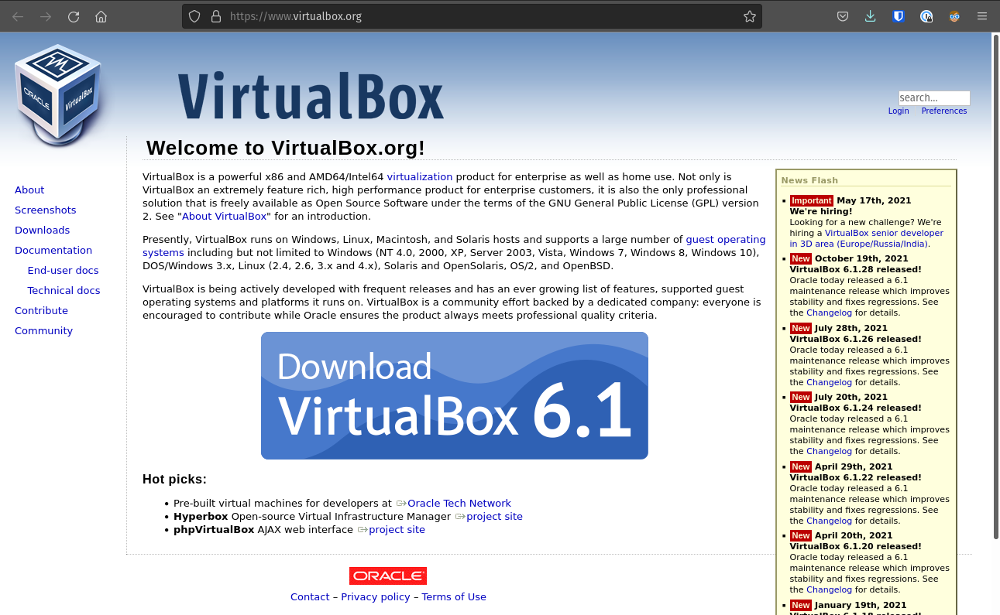

## VirtualBox

This configuration will walk you through the steps of downloading and installing [Oracle VM VirtualBox](https://www.virtualbox.org/).

VirtualBox is a *virtualization* tool. It will allow you to create a virtual operating system inside of your host operating system. Using this tool we will be able to begin working with a Linux Operating System inside of your personal operating system without compromising the integrity of your current Operating System. VirtualBox will handle all the implementation details and will create a isolated sandbox environment with the guest Linux Operating System.

## Downloading

First up we need to download the VirtualBox software onto our host machine.

At the time of writing VirtualBox 6.1 is the Oracle recommended version, however we recommend using the currently recommended version when you are downloading VirtualBox. See the following picture as an example.

Clicking the giant blue button stating `Download VirtualBox 6.1` should lead you to the [downloads page](https://www.virtualbox.org/wiki/Downloads) which has links for many common Operating Systems. The downloads page should like the following image.

On this page you should see multiple links that coincide with your Operating System. Upon clicking one of these links it should automatically start a download that will work for your OS.

{}
If you are using a Linux based operating system the link from the downloads page will take you to another page with various options, find the one for your specific distribution.
{}

### MacOS - Instructions

#### MacOS - Download

The direct link for the MacOS VirtualBox download can be found [here](https://download.virtualbox.org/virtualbox/6.1.28/VirtualBox-6.1.28-147628-OSX.dmg).

{}
The link will start a download for the **.dmg** file needed to install VirtualBox on a MacOS system.
{}

#### MacOS - Installing

{}

- double click the .dmg file

- double lick the PKG file

- brings up an installer, click the allow button

- This will bring up the following tab
  - click continue

{}
You may be thinking that you are missing an image for the destination select view. The installer should skip past this automatically. If it does not leave the settings as they are defaulted
{}

- installation type

  - click install
  - might ask for password, click on the use password button and provide your credentials

- installation
  - it will take some time as it's running scripts

{}
In the picture below you will notice that there is a System Extension Updated. This may pop up at a different time during your installation process.  You can click the open security preferences button and we will continue with those instructions later in this walkthrough.
{}

- When you click the Open Security Prefences button it will bring up the following window. We are going to set this window aside until our installation is complete.

{}
Before moving forward with the security preferences section of this installation process please ensure that the installation was successful. This should be indicated through the installer and look similar to the image below
{}

{}
Do not move forward with the below instructions until the installation process is complete! Please see above image and details for more information.
{}

  - unlock security preferences by hitting the padlock icon in the bottom left corner

- Enter your password

  - click the allow button next to "System software from developer "Oracle America, Inc" has been updated

  - Hit the restart button and your machine will restart
{}
Do not restart your machine until the installation has been completed

{}

- After your machine restarts you should find your VirtualBox.app within your applications folder. You can locate this by openning your finder and selecting the applications tab.
{}

Alternatively you can find it by hitting command + spacebar and typing in the program name "VirtualBox.app"
{}

- summary
- installation was successful and close

finally this is what you should see when everything has been installed properly and you open the program.

{}

### Windows - Instructions

{}

#### Windows - Download

The direct link for the Windows VirtualBox download can be found [here](https://download.virtualbox.org/virtualbox/6.1.28/VirtualBox-6.1.28-147628-Win.exe)

{}
The link will start a download for the **.exe** file needed to install VirtualBox on a Windows system.
{}

#### Windows - Installation

- double click the .exe file
- brings up an installer
  - click allow
  - form
    - introduction
      - click continue
    - destination select
      - don't need to do anything here (leave on defaults)
    - installation type
      - click install
      - might ask for password, give it your credentials and click ok
    - installation
      - it will take some time as it's running scripts
      - open your system security preferences
    - summary
      - installation was successful and close

finally this is what you should see when everything has been installed properly and you open the program.

{}

## Summary

In this article we downloaded and installed Oracle VirtualBox onto our host computers. In the next configuration article we will be using VirtualBox to create a virtual machine image of Ubuntu, which will be the Linux distribution used in this class.

Look over the [Ubuntu Configuration Article]() to complete the configurations necessary for this course.