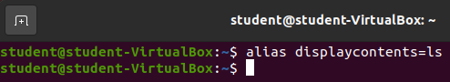
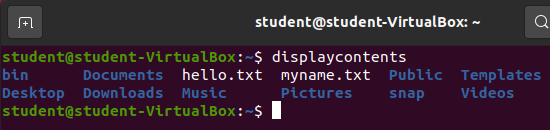
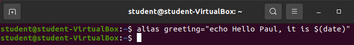
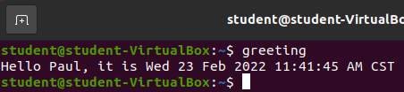

## Bash Aliases

One of the hallmark features of Linux and GNU is how customizable and extendable they are.

In an earlier demo we saw the instructor create a new program, and add the directory containing the program to their `$PATH` variable, allowing them to use the program directly from their Bash shell!

This section explores creating bash `aliases` that act as shortcuts to other commands. This is a way you can add some quick functionality to increase your own workflow.

The `alias` command allows you to create a new shortcut keyword that when executed in a Bash shell will execute the command linked to the `alias`.

### New `displaycontents` Bash `alias`

The `ls` command displays the contents of the current working directory.

Let's create a new `alias` called `displaycontents` which will simply execute the `ls` command.

`alias displaycontents=ls`

Upon executing this command nothing was displayed to the terminal, however your current Bash shell session registered a new `alias` called `displaycontents`.

Simply execute your new `alias` by entering `displaycontents`

Our Bash shell has a `displaycontents` alias registered and it was configured to run the `ls` command when executed, which you can see happened in the above image.

{}
The `displaycontents` alias isn't very useful, but serves as a demonstration for creating and using Bash aliases. Most people will create new aliases when they find themselves using the same complex commands over, and over again as a way of simplifying their work.
{}

### New `greeting` Bash `alias`

Let's create a new `alias` called `greeting`.

`alias greeting="echo Hello Paul, it is $(date)"`

Now execute the `greeting` alias:

This is a more complex alias and is doing something we haven't seen before. Inside of the `echo` command it is invoking another Bash shell command named `date`. 

{}
The syntax `$(command)` is a Bash shell **command substitution**. It essentially means the `date` command is executed first and its output is used in place of the second command being executed which is `echo`. We will learn more about **command substitution** and some more advanced Bash features in a later chapter.
{}