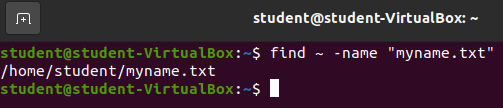
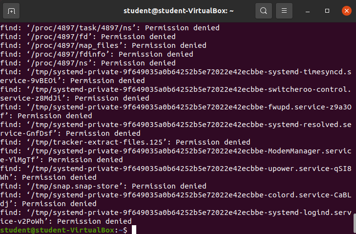
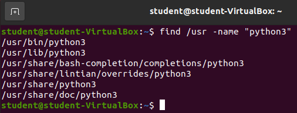
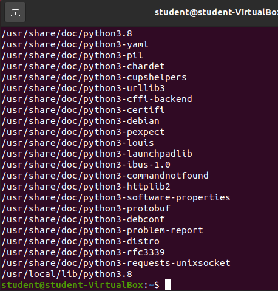

## Finding Files

If you haven't noticed by now, Linux/GNU is a file based operating system. You can actively look at (and in many cases modify or delete) almost any of the files that make Linux work. However having such a huge number of files can make finding the files you need a difficult task.

Luckily there are many tools that help us find the files we are looking for. One of which is the `find` command.

The `find` command takes two arguments: a **directory to search**, and a **search pattern** (in this class the pattern will predominately be a filename).

Let's search our home directory for any files named `myname.txt`.

`find ~/ -name "myname.txt"`

The command found **one** matching file with the absolute path of `/home/student/myname.txt`. 

{}
We did provide one option to the `find` command called `-name`. We were telling the find command that the provided pattern only needs to match the filename instead of all parts of the filepath. This is a nice option to include as it will not match if any directories matched our pattern.
{}

## Finding Files in Directories Above Home

As you are continuing on your Linux/GNU learning journey you may learn about various tools found in the `/bin`, or interesting files in `/etc` or other locations outside of the `/home` directory. If you want to read these files, or learn about their locations you can use the `find` tool.

Let's use `find` to find the `python3` binaries starting at the root (`/`) directory.

`find / -name "python3"`

That was overwhelming! There are dozens of files that match `"python3"` just for filenames in our entire computer. Many of the files we do not even have permission to **read** which is why we are getting `Permission denied` errors.

Let's run our `find` command again, but instead of starting at the root directory, let's start at the `/usr` directory.

`find /usr -name "python3"`

This is definitely more manageable as we are only looking for files matching `"python3"` in the user directory. 

### Using Wildcards with `find`

In an earlier lesson we looked at `/usr/bin/python3`. However, there was also a `/usr/bin/python3.8` in the same location. This file did not match our explicit pattern of `"python3"`. However, we can use a Bash shell wildcard (`*`) to increase the amount of potential matches.

`find /usr -name *"*python3*"`

Another long list, but we do have at least read access on all of the results. Note how the `find` command matched any file name starting with `"python3"`, but matched any text after that match. That's the power of the Bash shell wildcard `*`.

In this list you should see both `/usr/bin/python3` and `/usr/bin/python3.8` near the top of the list, you will probably need to scroll up to see.

{}
The `/usr` directory contains data, binaries, and documentation that are available to general **users** of the computer. It's a great place to search for tools that are available across users, but aren't used by the kernel to perform it's many tasks. You can learn more about the `/usr` directory at the [LDP Linux Filesystem Hierarchy Documentation](https://tldp.org/LDP/Linux-Filesystem-Hierarchy/html/usr.html).
{}