## Navigation Commands

### Review: Where am I?

To get your bearings and view your current working directory you can use the familiar `pwd` command.

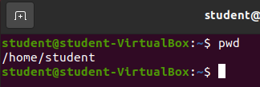

{}
The `pwd` command simply prints out the contents of the `$PWD` shell variable. Don't forget you can see the contents of any shell variables with the `echo` command!
{}

### Review: What are the contents of this location?

To view the contents of the current working directory you can use the familiar `ls` command without any arguments.

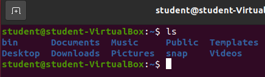

### Change Current Working Directory

To change the current working directory you can use the `cd` *builtin* command. 

`cd` allows for one optional argument the new path to use as the current working directory. If no argument is provided it will set the current working directory to the `$HOME` shell variable.

`cd` works with both *absolute* and *relative* paths.

#### `cd` relative path

Starting from the home directory we could move into the `Documents/` directory with the following command:

`cd Documents`

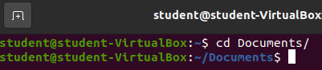

Take note from the image that our terminal emulator always tells us the current working directory. You should see `~/Documents$` directly before the character where you can enter text commands. You can also see on the previous line before the `cd` command had been executed the text directly before our input area is only `~$`. 

#### `cd` absolute path

Our current working directory is `/home/student/Documents`. We can return to the home directory by using an absolute path:

`cd /home/student/`

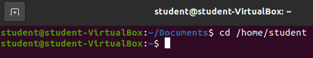

And we're back to `$HOME`!

The main benefit in using an *absolute* path as the argument for the `cd` command is it will work from any location. The absolute path is an unique identifier for a directory.

#### Shell Shortcuts

Another useful tool for changing directories is to learn some of the Bash shell shortcuts.

- `~`: a shortcut for the `$HOME` variable
- `.`: a shortcut for the current working directory (`$PWD` variable)
- `..`: a shortcut for the parent of the current working directory

##### Shortcut Home

From a terminal change into the root directory:

`cd /`

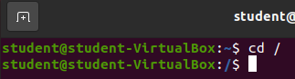

From the root directory change into the home directory by using the home shortcut:

`cd ~`

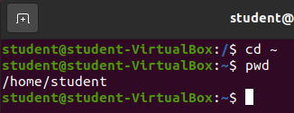

{}
The default argument for the `cd` command is the home directory. An even more efficient shortcut for changing into the home directory would be simply `cd` with no arguments. Try it out on your own, by changing into the root directory, and then entering `cd` without any arguments.
{}

##### Shortcut to Parent

From your home directory let's change into the parent directory using the `..` shortcut:

`cd ..`

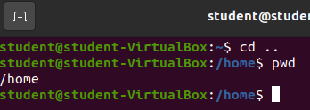

Using the parent directory shortcut we were able to move up one directory.

{}
You can extend the parent and current directory shortcuts. Assuming you are in `/home/student/Documents` you can change into `/home/student/Desktop` with the command: `cd ../Desktop`.
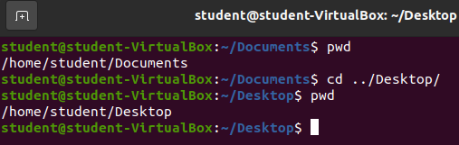
Additionally, the parent and current directory shortcuts can be used with most bash commands.
{}

## Creation Commands

In your learning journey you have very likely heard the acronym **CRUD**. Which stands for:

- **C**reate
- **R**ead
- **U**pdate
- **D**elete

This is the collection of actions you can perform on any given record, object, or in the case of Linux files/directories.

In the following sections we will be learning about, and practicing, some commands that can be used to perform **CRUD** actions on files and directories from our Bash shell.

### Create Directory

You can create a new directory with the `mkdir` command. Let's use it to create a new directory named `temp` in our home directory. With your current working directory as your home directory enter:

`mkdir temp`

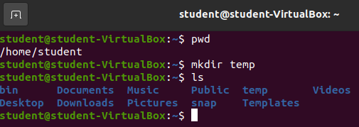

When `mkdir` runs successfully there is no standard output (`STDOUT`) displayed to the user. To see the new directory you can run the `ls` command to see the contents that were created in the current working directory.

{}
You can use absolute or relative paths with the `mkdir` command.
{}

### Create File

You can create a new *empty* file with the `touch` command. In our home directory let's create a new file called `temp.file`.

`touch temp.file`

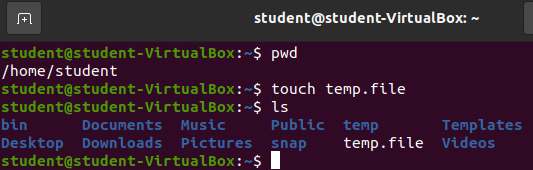

Again, a successful `touch` command will provide no message to standard output (`STDOUT`). To see the new `temp.file` you will need to run the `ls` command as shown in the picture.

### Creating Hidden Files/Directories

A hidden file or directory is denoted by the name starting with a period (`.`). We can create hidden files and directories using the exact command above, but adding the period (`.`) to the file name.

#### Hidden Directory

From your home directory create a new hidden-directory:

`mkdir .hidden-directory`

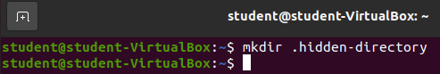

To see this new hidden directory we will need to run the `ls` command with the the `-a` option so **all** files are displayed.

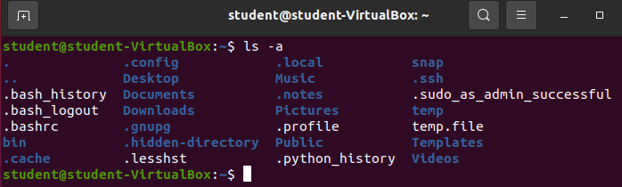

You may have to look for it, but you should find the new `.hidden-directory` that resulted from the execution of the `mkdir` command.

#### Hidden File

Let's change into the new `.hidden-directory`.

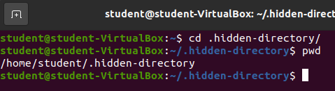

Now create a new hidden file named `.hidden.file`.

`touch .hidden.file`

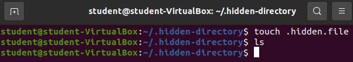

To see the hidden file you will again need to run:

`ls -a`

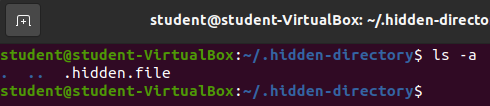

## Reading Contents

Let's learn how to **R**ead files and directories.

You already know how to list the contents of a directory with the `ls` command.

You can list the contents of a file in a few different ways:

### Concatenate and Display

The `cat` command will concatenate all of the contents of a file into an ASCII string and display in the terminal window.

Let's take a look at the contents at some of the files on our machine.

#### `cat /etc/hostname`

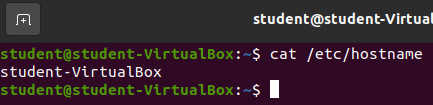

This is the hostname on record for this machine. This lines up with whatever you named your machine back when we first setup this VirtualBox image. If you followed our guide to the letter it should be `student-Virtualbox`.

The hostname is the name of the computer. Any given computer may have multiple users (in this case: `student`).

#### `cat /etc/timezone`

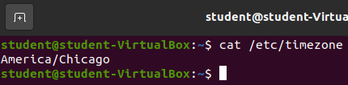

After installing the Ubuntu distribution onto our Virtualbox we configured our operating system including selecting our timezone. This is the file that keeps the record of our timezone!

#### `cat /etc/environment`

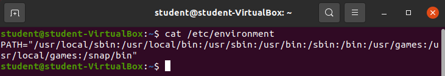

This is the file that coincides with the `$PATH` shell variable. This is known as the system wide `$PATH` all users (including the `student` and `root` users) use this base system wide path. If you added a directory to this file it would be shared across **all** users of the machine. 

{}
A user wouldn't add something to the system wide path, they would make their changes in the `~/.bashrc` file which would only make changes to their specific path. We will learn about later in this lesson.
{}

#### `cat ~/.bash_history`

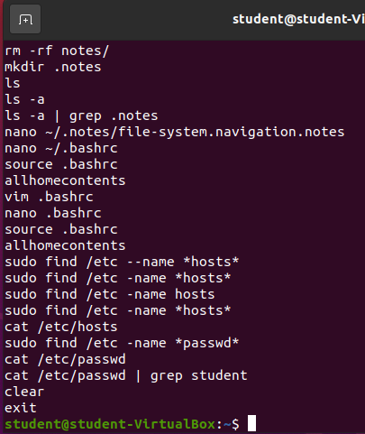

{}
Your history will be different from the picture!
{}

This is the text file tracking all of the commands of all of the most recent bash shell's initialized by the user. There is so much information you would have to scroll in the terminal window to see the start of the command.

#### `history`

The preferred way of viewing the history of any given Bash shell is by using the `history` builtin command.

Enter `history`

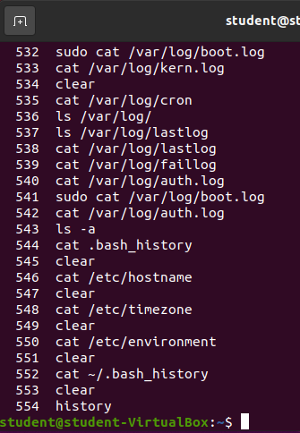

### Display and Parse Interactively

When files have a lot of content it's not always ideal to `cat` the file and scroll using the terminal window. This is a manual and tedious process, not to mention the terminal window only has access to a certain amount of memory and very large files will have their content truncated after the memory has been exceeded.

Luckily, there are multiple programs that chunk the contents of the file into memory and display them in an interactive fashion. One of these programs is called `less`.

There are some tips and tricks you need to know about using `less` to read files. After opening a file with `less` your terminal will change to display the file and you will lose access to your bash shell until you exit the `less` program. 

You can scroll up and down in `less` with the directional (arrow) keys. You can also scroll up by pressing the `j` key and you can scroll down with the `k` key.

To exit `less` you simply need to press the `q` key.

Let's give it a try.

#### `less ~/.bash_history`

Before executing the command you will see:

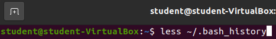

After executing the command you will see something similar to the following picture.

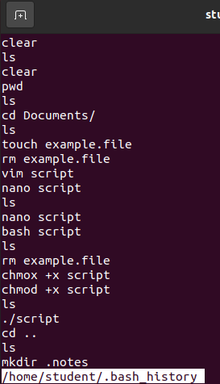

From here you have the full power of `less` at your fingertips, you can move to any line on the file by navigating with the tips listed above.

When you are ready to exit the file you simply need to press the `q` key. This will return you back to your Bash shell.

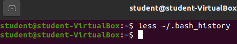

##### Bonus

{}
- `/etc/hostname`
- `/etc/timezone`
- `/etc/nanorc`
- `/etc/group`
- `/etc/gshadow` --> need elevated permissions (more of a demo)
- `/etc/environment` --> system wide environment variables
- `/etc/profile` --> login shell environment variables
- `~/.bashrc` --> individual user bash shell initialization execution script (individual shell environment variables)
- `/etc/apt/sources.list`
- `/var/log/syslog`
- `/var/log/message`
- `/var/log/boot.log`
- `/var/log/kern`
- `/var/log/cron`
- `~/.bash_history`
{}

### Display contents in Text Editor

Another common way to display (and edit if necessary) is by using a terminal text editor.

An example of this would be running the `nano filename` command. This would open the file contents with the GNU text editor `nano`.

{}
If you open a file with a terminal text editor you will need to figure out how to exit the file to get back to your bash shell. In `nano` you can exit a file by pressing the control and x keys (`ctrl` + `x`).
{}

We will see examples of this when we learn about editing the contents of files with `nano` in a later section.

{}
Many IDEs and graphical text editors also provide a shell command for opening a file with the chosen IDE/text editor! If you install Visual Studio Code onto your distribution you can open a file directly into VSC with the `code filename` command. We will see an example of this when we learn about installing additional software in the Package Manager section.
{}

## Deleting Files and Directories

Let's learn how to **D**elete files and directories.

`rm` command

### Delete Recursively

`rm -r`

#### Delete Recursively with Force!

`rm -rf`

{}
Linux will do what you tell it. If you tell it to delete a directory recursively with force it will not ask again. As long as you have permissions to edit a file it will be completely destroyed. Many horror stories exist around people accidently running `rm -rf` against their entire home directory and losing **all of their files**. Even worse targeting the root directory in which individuals have effectively **deleted their OS**...
{}

## Update Files and Directories

You can either update the contents of a file/directory or the metadata (name, last modified, permissions) of a file/directory.

### Updating Metadata

#### Moving Files and Directories

Updating the absolute path of the given file.

`mv`

#### Moving to Rename Files and Directories

`mv`

#### Changing Additional Metadata

{}
You can change a file's permissions with the `chmod` command. It will allow you to set a user (or groups) permissions to read, write and execute a specific file. In the Bash: Introduction - Demo the instructor added the execute permission to all users and groups. You can also change the owner of a file with the `chown` command.
{}

### Updating File Contents

Open file using terminal text editor.

- `nano filename`
  - `vim filename`
  - `emacs filename`

{}
`echo "newline" >> filename`
{}

Open the file in your favorite text editor or IDE. Visual Studio Code, IntelliJ, Pycharm, Atom, etc.

### Using `nano`

#### Open File

#### Write File

#### Exit File

## Finding Files

## Bash Alias

## `.bashrc`

## `sudo`

<!-- 

- navigation commands
  - `pwd`
  - `ls`: read contents of directory
  - `cd` relative path
  - `cd` absolute path
  - shortcuts
    - `.` current directory
    - `..` parent directory
    - `~` current user's home directory
- creating commands
  - directory
    - `mkdir new-dir`
  - file
    - `touch new-file`
- hidden folders/files
  - `mdkir .hidden-folder`
    - `ls`
    - `ls -a` or `ls -A`
  - `touch .hidden-file`
    - `ls`
    - `ls -a` or `ls -A`
- reading contents of file
  - `cat some-file`: read contents of file
- finding files
  - `find location -name filename`
  - `find location -name '*.file'`
  - `find location -name '*README.md'`
  - `find location -regex '.*/*+README.md'`
- moving / editing filename
  - `mv`
    - move file to a new location
      - `mv ./examplefile ~/new-location/`
    - rename file in current location
      - `mv ./examplefile new-file-name`
    - move file to a new location and rename file
      - `mv ./examplefile ~/new-location/new-file-name`
    - move folder to a new location
      - `mv ./example-directory/ ~/new-location`
    - rename directory in current location
      - `mv ./example-directory/ new-directory-name`
    - move folder to a new location and rename file
      - `mv ./example-directory/ ~/new-location/new-directory-name`
- deleting files
  - `rm`
- deleting directories
  - `rmdir`: only deletes **empty** directories
    - `rm target-directory/*`: delete all files inside a directory
    - `rmdir target-directory`: delete now empty directory 
  - `rm -r target-directory`: delete directory **recursively**. An irreversible action that will delete whatever it is pointed at will check in with the user before removing any *write-protected* files.
  - `rm -rf target-directory`: delete directory **recursively** with **force**. An irreversible action that will delete whatever it is pointed at without checking in with the user before removing any *write-protected* files.
- editing contents of a file
  - `nano some-file`
  - Nano basics
    - directional pad navigation
    - great for making edits to existing files
    - `ctrl+o`: save file
    - `ctrl+x`: exit file
  - Vim/Emacs note
- alias
  - customizing our personal shells with custom commands
    - homecontents: `ls ~`
  - `.bashrc`
    - adding an alias `homecontents` to `.bashrc`
- `sudo`
  - students will need sudo to cat out some files, and look into some directories so they just need to know what the command means substitute user do and the default argument is the root user (who has the highest level of permissions)
  -->