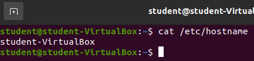
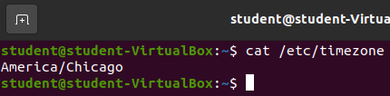
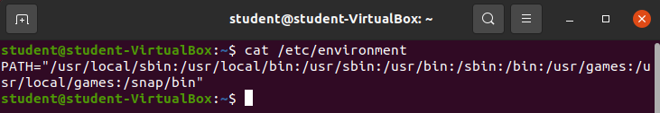
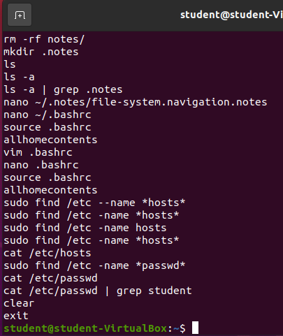
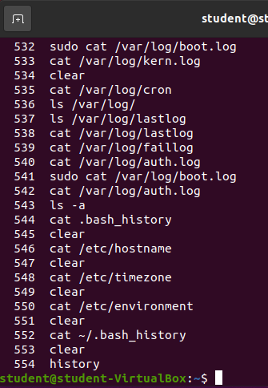
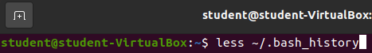
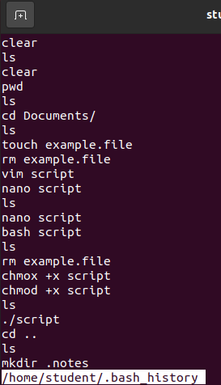
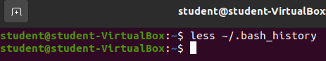

## Reading Contents

Let's learn how to **R**ead files and directories.

You already know how to list the contents of a directory with the `ls` command.

You can list the contents of a file in a few different ways:

### Concatenate and Display

The `cat` command will concatenate all of the contents of a file into an ASCII string and display in the terminal window.

Let's take a look at the contents at some of the files on our machine.

#### `cat /etc/hostname`

This is the hostname on record for this machine. This lines up with whatever you named your machine back when we first setup this VirtualBox image. If you followed our guide to the letter it should be `student-Virtualbox`.

The hostname is the name of the computer. Any given computer may have multiple users (in this case: `student`).

#### `cat /etc/timezone`

After installing the Ubuntu distribution onto our Virtualbox we configured our operating system including selecting our timezone. This is the file that keeps the record of our timezone!

#### `cat /etc/environment`

This is the file that coincides with the `$PATH` shell variable. This is known as the system wide `$PATH` all users (including the `student` and `root` users) use this base system wide path. If you added a directory to this file it would be shared across **all** users of the machine. 

{}
A user wouldn't add something to the system wide path, they would make their changes in the `~/.bashrc` file which would only make changes to their specific path. We will learn about later in this lesson.
{}

#### `cat ~/.bash_history`

{}
Your history will be different from the picture!
{}

This is the text file tracking all of the commands of all of the most recent bash shell's initialized by the user. There is so much information you would have to scroll in the terminal window to see the start of the command.

#### `history`

The preferred way of viewing the history of any given Bash shell is by using the `history` builtin command.

Enter `history`

### Display and Parse Interactively

When files have a lot of content it's not always ideal to `cat` the file and scroll using the terminal window. This is a manual and tedious process, not to mention the terminal window only has access to a certain amount of memory and very large files will have their content truncated after the memory has been exceeded.

Luckily, there are multiple programs that chunk the contents of the file into memory and display them in an interactive fashion. One of these programs is called `less`.

There are some tips and tricks you need to know about using `less` to read files. After opening a file with `less` your terminal will change to display the file and you will lose access to your bash shell until you exit the `less` program. 

You can scroll up and down in `less` with the directional (arrow) keys. You can also scroll up by pressing the `j` key and you can scroll down with the `k` key.

To exit `less` you simply need to press the `q` key.

Let's give it a try.

#### `less ~/.bash_history`

Before executing the command you will see:

After executing the command you will see something similar to the following picture.

From here you have the full power of `less` at your fingertips, you can move to any line on the file by navigating with the tips listed above.

When you are ready to exit the file you simply need to press the `q` key. This will return you back to your Bash shell.

##### Bonus

{}
- `/etc/hostname`
- `/etc/timezone`
- `/etc/nanorc`
- `/etc/group`
- `/etc/gshadow` --> need elevated permissions (more of a demo)
- `/etc/environment` --> system wide environment variables
- `/etc/profile` --> login shell environment variables
- `~/.bashrc` --> individual user bash shell initialization execution script (individual shell environment variables)
- `/etc/apt/sources.list`
- `/var/log/syslog`
- `/var/log/message`
- `/var/log/boot.log`
- `/var/log/kern`
- `/var/log/cron`
- `~/.bash_history`
{}

### Display contents in Text Editor

Another common way to display (and edit if necessary) is by using a terminal text editor.

An example of this would be running the `nano filename` command. This would open the file contents with the GNU text editor `nano`.

{}
If you open a file with a terminal text editor you will need to figure out how to exit the file to get back to your bash shell. In `nano` you can exit a file by pressing the control and x keys (`ctrl` + `x`).
{}

We will see examples of this when we learn about editing the contents of files with `nano` in a later section.

{}
Many IDEs and graphical text editors also provide a shell command for opening a file with the chosen IDE/text editor! If you install Visual Studio Code onto your distribution you can open a file directly into VSC with the `code filename` command. We will see an example of this when we learn about installing additional software in the Package Manager section.
{}