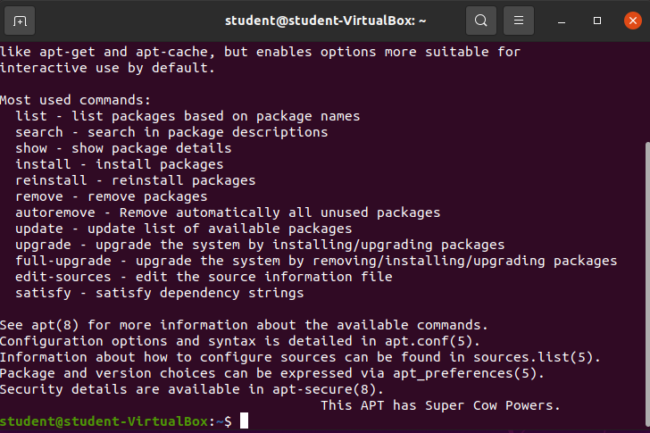

## Prepare

Before using any new tool it's always a great idea to take a look at the provided documentation.

### `apt` Man Page

Enter `man apt` and look over the description.

### `apt --help` Option 

Enter `apt --help` and look over the displayed information.

{}
Using the `apt` CLI man page and the `--help` option challenge yourself to use this walkthrough as a reference.
{}