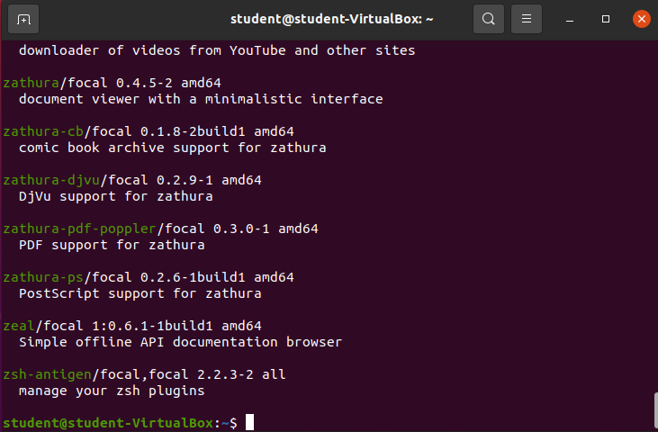
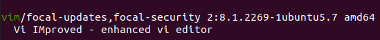
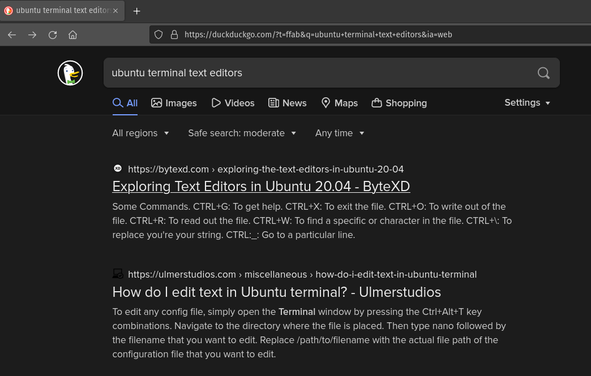
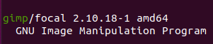

Not all packages come installed on your operating system. However, through using your operating system you may need to find and properly install new packages.

Before you can install a package we must figure out how to find a package.

{}
Before searching for packages you should [Update Package Repositories]() with: `sudo apt update`.
{}

## `apt search [package-name]`

If you already know the name of the package you are interested in you can just search for it by name using `apt search`. Let's search for the popular terminal text editor called `vim`.

### Enter `apt search vim`

Lots of entries mention vim in their description, or name. Scroll through the list and you should find:

That's exactly what I'm looking for the `Vi IMproved - enhanced vi editor`.

{}
The `vim` text editor is popular and highly customizable. You may have noticed the large number of packages that plug in to vim to provide features for specific programming languages or technologies.
{}

## Using the Internet

In order to use `apt search` you have to already know the package name, or luck into guessing some part of the description of a package. This is not always possible. Regularly you will find new packages when researching how to accomplish some task in Linux.

### Searching for Terminal Text Editors

You know the task you want to accomplish, so you can leverage the internet to discover packages/tools that can assist you in your task.

We know we want to edit files from the terminal in Ubuntu. So let's go to a search engine and search for it:

`ubuntu terminal text editors`

You may want to check out a couple of different results, but mainly we are on a discovery mission, so I'll just focus on the first article for now: [Exploring Text Editors in Ubuntu 20.04 - ByteXD](https://bytexd.com/exploring-the-text-editors-in-ubuntu-20-04/).

It's an article with the date of Oct 23, 2021. Pretty quick read, just mentioning some terminal text editors this specific author has heard of including both terminal (CLI) and graphical (GUI).

The CLI options the article lists:

- `vi/vim`
- `nano`
- `kakoune`
- `emacs`
- `ne`

We don't want to learn 5 different packages that allow us to accomplish the same task. We simply need to use one. We will need to conduct further research to choose the tool that is right for our problem, and for us personally.

{}
Go ahead and try out `apt search [package-name]` on all of the listed items to see if there is a package associated with each of the 5 tools listed above. You may find using some Regex anchors beneficial while searching. Try `apt search vim` & `apt search ^vim$`. How are the results different? What are the keywords you've learned from this hint you can use to learn more? (`Regex` & `Regex anchors`)
{}

### Searching for Image Editors

Search for: `ubuntu image editor`.

My top result was: [linuxhint: Best Image Editor for Ubuntu](https://linuxhint.com/best_image_editor_ubuntu/).

It is an article from 2 years ago talking about the popular GNU Image Manipulation Program (`GIMP`). It's a GNU package so we can probably assume we can access it with our package manager, but we can always search to make sure with `apt search gimp`.

Again, we just discovered the package using the internet. We will need to do more research into if the tool is a good choice for our specific task, and we may need to learn how to use the tool.