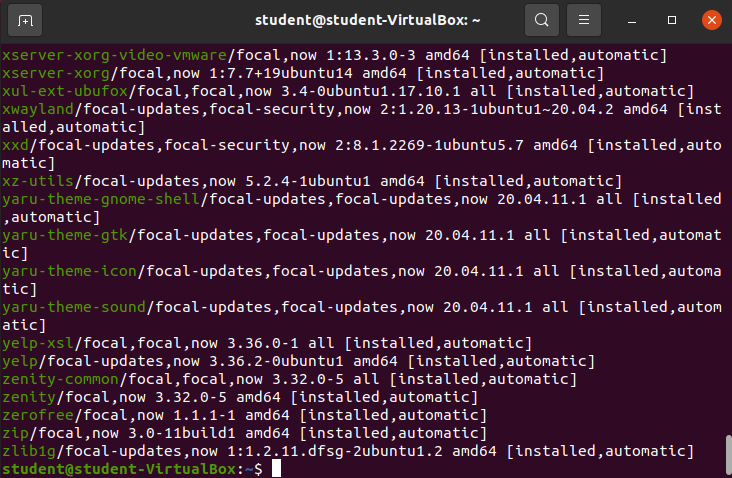
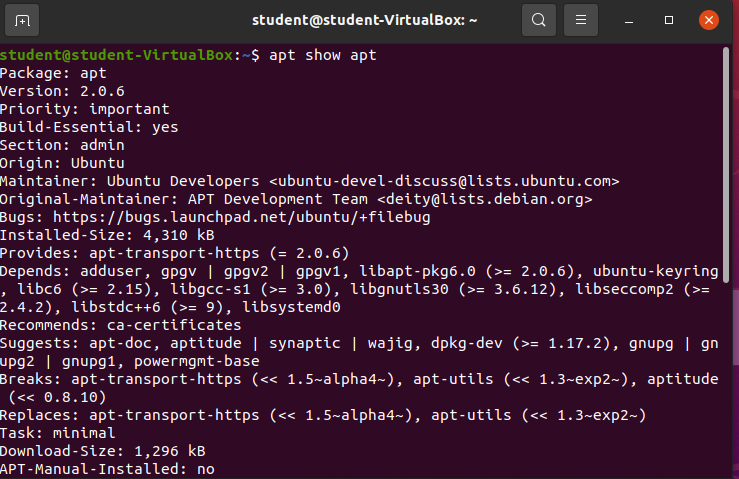
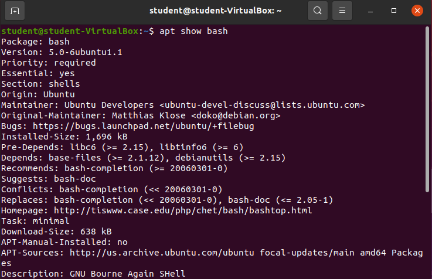
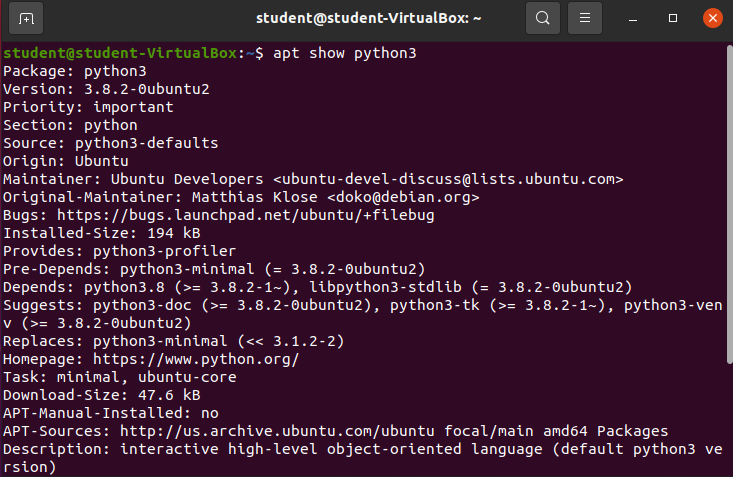

Being able to access the metadata of package can be useful. This article shows how to view all currently installed packages, and how to look at some of the metadata associated with any specific installed package.

## Viewing All Installed Packages

Enter: `apt list --installed`

There are so many installed packages that they cannot be displayed within one Bash shell session.

{}
It's pretty rare you would need to see **all** of the installed packages on a machine. Much more informative is looking at the metadata for a specific package.
{}

## Viewing a Specific Package

We can use the `apt show` command to view some of the metadata, and OS level configuration information about any specific package. The structure for this command is: `apt show [package]`. Let's try it out on a couple of different packages

### Enter `apt show apt`

### Enter `apt show bash`

### Enter `apt show python3`

## Package Metadata Breakdown

Each of the examples listed above show a ton of different metadata including:

- Package: The name of the package
- Version: The version of the currently installed package
- OS Priority: If this package is required for the current distribution to operate normally
- Origin: The party that controls the package
- Maintainer: The party that maintains the package
- Depends: All the packages this specific package needs to function properly
- Suggests: Additional related packages you may want to use in addition to this package
- Description: What the package is used for

{}
All of this metadata simply describes the package. However to learn how to use the package you should look at the package homepage, the `man` reference page, or the ``--help`` option.
{}