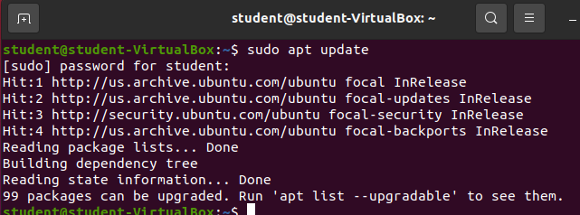

When dealing with Package Manager a common task is to **refresh** your list of package repositories and **download the metadata of all packages**. This is a common task to complete before installing a new package or upgrading any existing packages because it ensures our Package Manager has the most up to date information on all packages.

{}
Being able to update the metadata about the packages is a very important task. There are tons of packages and all of them are actively maintained which takes the form of: bug squashing, vulnerability patching, feature adding, optimization, etc. Each of these changes usually results in a new version (or build) of the package which adds to the metadata of the package. Being able to update our package manager allows us ot learn of any of these changes without upgrading any of our packages.
{}

## `sudo apt update`

Updating from the CLI is quite easy. We simply enter `sudo apt update`:



You can see from the display that it is reading all package lists from our configured Ubuntu package repositories.

The command also detected that 99 packages can be upgraded as there are newer versions as dictated by the package lists.

### `man apt`

It's always a good idea to read the documentation of the tools you are working with. You can manually search the Manual Reference Page for `apt` to find the `update` section, or take a look at the section we copied for you:

From Man page:
```bash
update is used to download package information from all configured
           sources. Other commands operate on this data to e.g. perform
           package upgrades or search in and display details about all
           packages available for installation.
```